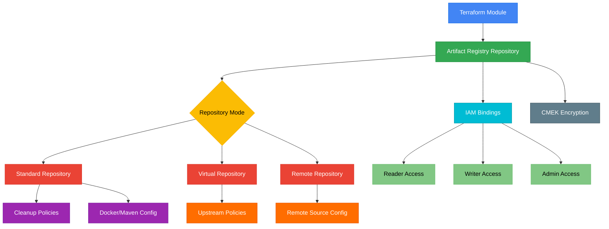

# terraform-gcp-artifact-registry

A production-ready Terraform module for managing Google Artifact Registry repositories with support for multiple package formats, repository modes, cleanup policies, IAM bindings, and encryption.

## Architecture



## Features

- **Multiple Formats**: Docker, Maven, npm, Python, APT, YUM, Go, Generic
- **Repository Modes**: Standard, Virtual (aggregation), Remote (proxy/cache)
- **Cleanup Policies**: Automated artifact lifecycle management with dry-run support
- **IAM Bindings**: Granular access control at the repository level
- **CMEK Encryption**: Customer-managed encryption keys via Cloud KMS
- **Docker Config**: Immutable tags for container image repositories
- **Maven Config**: Version policy and snapshot overwrite controls

## Usage

### Basic

```hcl
module "artifact_registry" {
  source = "path/to/terraform-gcp-artifact-registry"

  project_id    = "my-project"
  location      = "us-central1"
  repository_id = "my-docker-repo"
  format        = "DOCKER"
}
```

### With Cleanup Policies

```hcl
module "artifact_registry" {
  source = "path/to/terraform-gcp-artifact-registry"

  project_id    = "my-project"
  location      = "us-central1"
  repository_id = "my-docker-repo"
  format        = "DOCKER"

  cleanup_policies = [
    {
      id     = "delete-untagged"
      action = "DELETE"
      condition = {
        tag_state  = "UNTAGGED"
        older_than = "2592000s"
      }
    },
    {
      id     = "keep-latest"
      action = "KEEP"
      most_recent_versions = {
        keep_count = 5
      }
    }
  ]
}
```

## Requirements

| Name | Version |
|------|---------|
| terraform | >= 1.3 |
| google | >= 5.0 |
| google-beta | >= 5.0 |

## Inputs

| Name | Description | Type | Default | Required |
|------|-------------|------|---------|----------|
| project_id | The GCP project ID | `string` | n/a | yes |
| location | The location (region) for the repository | `string` | `"us-central1"` | no |
| repository_id | The repository ID | `string` | n/a | yes |
| description | Description of the repository | `string` | `""` | no |
| format | Package format (DOCKER, MAVEN, NPM, PYTHON, etc.) | `string` | `"DOCKER"` | no |
| mode | Repository mode (STANDARD_REPOSITORY, VIRTUAL_REPOSITORY, REMOTE_REPOSITORY) | `string` | `"STANDARD_REPOSITORY"` | no |
| kms_key_name | Cloud KMS key for CMEK encryption | `string` | `null` | no |
| labels | Labels to apply to the repository | `map(string)` | `{}` | no |
| cleanup_policies | List of cleanup policy objects | `list(object)` | `[]` | no |
| cleanup_policy_dry_run | Enable dry-run mode for cleanup policies | `bool` | `false` | no |
| docker_config | Docker-specific configuration | `object` | `null` | no |
| maven_config | Maven-specific configuration | `object` | `null` | no |
| virtual_repository_config | Virtual repository upstream policies | `list(object)` | `[]` | no |
| remote_repository_config | Remote repository configuration | `object` | `null` | no |
| iam_bindings | IAM role bindings map | `map(list(string))` | `{}` | no |

## Outputs

| Name | Description |
|------|-------------|
| repository_id | The repository ID |
| repository_name | The full resource name of the repository |
| repository_url | The URI of the repository |
| create_time | Repository creation timestamp |
| update_time | Repository last update timestamp |
| format | The repository format |
| mode | The repository mode |
| effective_labels | The effective labels on the repository |

## Examples

- [Basic](examples/basic/) - Simple Docker repository
- [Advanced](examples/advanced/) - Repository with cleanup policies and IAM
- [Complete](examples/complete/) - Virtual and remote repositories with full configuration

## License

MIT License - Copyright (c) 2024 kogunlowo123
